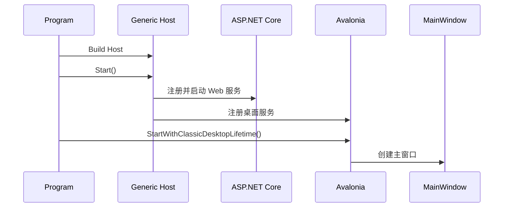
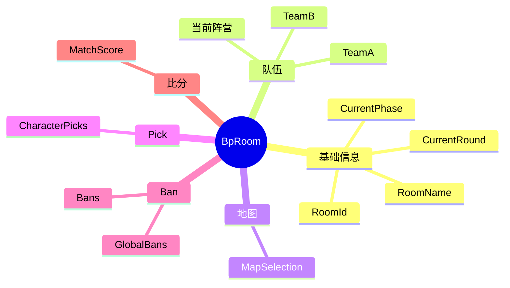
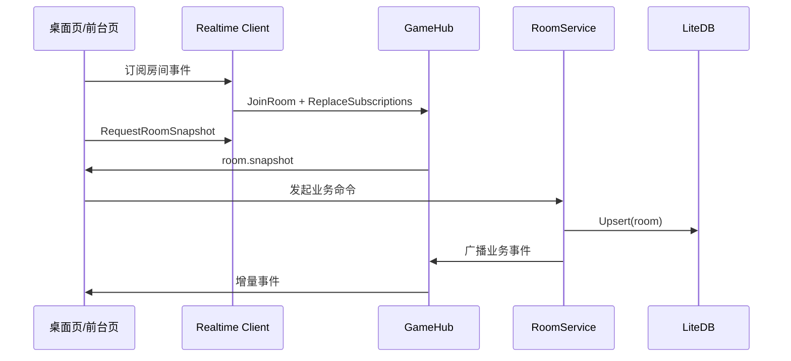
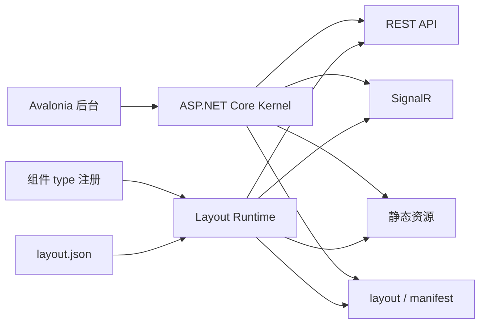

# Idvbp.Neo 开发文档

这份文档做两件事：

1. 讲清楚 `Idvbp.Neo` 现在的真实架构和关键实现。
2. 把“新前台系统”的组件/页面开发规范一并写进来，给后续开发统一标准。

文档尽量用通俗的话说清楚，避免只讲概念。

---

## 1. 先用一句话理解这个项目

`Idvbp.Neo` 不是一个普通桌面程序，也不是一个单独的网页项目。

它更像一个“本地比赛控制中台”：

- `Avalonia` 桌面端负责操作后台。
- 内嵌的 `ASP.NET Core` 负责状态、接口、资源、实时广播。
- 浏览器页面、OBS 叠加页、前台页面通过本地服务拿数据和接收事件。

可以把它理解成：

```text
桌面端 = 控制台
内嵌 ASP.NET Core = 业务中枢
LiteDB = 本地状态存储
SignalR = 实时总线
wwwroot / frontend = 展示层
```

---

## 2. 当前技术栈

### 桌面端

- `Avalonia 11`
- `FluentAvaloniaUI`
- `CommunityToolkit.Mvvm`

### 服务端

- `ASP.NET Core`
- `SignalR`
- `LiteDB`

### 前台/展示层

- `wwwroot/overlay` 下的静态 HTML/JS 资源
- `Idvbp.Neo.Frontend` 独立前端目录

说明一下：`Idvbp.Neo.Frontend` 目前还没有真正接入主业务，还是一个前端工程起点；当前真正参与业务展示的，主要还是 `wwwroot/overlay` 和服务端提供的资源、接口、实时事件。

---

## 3. 目录结构

```text
Idvbp.Neo.slnx
├─ Idvbp.Neo/
│  ├─ Client/         桌面端访问本地服务的 HTTP / SignalR 客户端
│  ├─ Controls/       导航、Frame 等桌面控件封装
│  ├─ Models/         核心业务模型
│  ├─ Server/         API、Hub、Middleware、Repository、资源服务
│  ├─ Service/        桌面端业务服务
│  ├─ ViewModels/     桌面端页面逻辑
│  ├─ Views/          Avalonia 页面
│  ├─ Resources/      角色图、地图图、默认配置等资源
│  ├─ wwwroot/        静态网页、overlay 页面
│  ├─ docs/           项目文档
│  ├─ appsettings.json
│  └─ proxies.json
├─ Idvbp.Neo.Core/
└─ Idvbp.Neo.Frontend/
```

---

## 4. 总体架构图

```mermaid
flowchart LR
    A[桌面端 Avalonia] --> B[BpApiClient HTTP]
    A --> C[RoomRealtimeClient SignalR]
    B --> D[内嵌 ASP.NET Core]
    C --> E[GameHub]
    D --> F[RoomService]
    F --> G[LiteDbRoomRepository]
    F --> H[RoomEventPublisher]
    H --> E
    D --> I[ResourceCatalogService]
    D --> J[ReverseProxyMiddleware]
    J --> K[/overlay 静态前台]
    J --> L[/proxy 外部前端]
    M[浏览器/OBS/前台页面] --> D
```

这个图表达的是：

- 桌面端并不直接操作数据库。
- 桌面端通过 HTTP 和 SignalR 访问本地服务。
- 真正的业务写入口在 `RoomService`。
- 浏览器前台和桌面端共享同一套状态源。

---

## 5. 启动流程

程序入口在 [Program.cs](C:/Users/luolan/RiderProjects/Idvbp.Neo/Idvbp.Neo/Program.cs)。

它做的事情很直接：

1. 创建 `Generic Host`
2. 把桌面端服务和 ASP.NET Core 服务都注册进去
3. 启动 Host
4. 启动 Avalonia 主窗口
5. 退出时统一停掉 Host

启动时序图：



这个设计很关键，因为它说明：

**这个项目是“一个进程里同时跑桌面和本地服务”。**

好处是：

- 部署简单
- 配置统一
- 桌面页、浏览器页、OBS 页都能共用同一个后端

---

## 6. 桌面端架构

### 6.1 基本结构

桌面端是比较标准的 MVVM：

- `View`：XAML 页面
- `ViewModel`：页面状态和命令
- `Service`：业务服务
- `Client`：调用本地 HTTP/SignalR

### 6.2 服务注册

[App.Services.cs](C:/Users/luolan/RiderProjects/Idvbp.Neo/Idvbp.Neo/App.Services.cs) 负责注册桌面端依赖。

目前比较重要的服务有：

- `NavigationService`
- `NavigationPageFactory`
- `BpApiClient`
- `RoomRealtimeClient`
- `BpRoomWorkspace`
- `IProxyPageConfigRepository`

当前注册思路也很清楚：

- 主窗口是单例
- 共享工作区是单例
- 页面和页面 ViewModel 大多是瞬态

这意味着：

**跨页面共享状态统一收敛到工作区服务，不靠页面之间互相传状态。**

### 6.3 主窗口导航

[MainWindow.axaml](C:/Users/luolan/RiderProjects/Idvbp.Neo/Idvbp.Neo/Views/MainWindow.axaml) 是桌面壳。

主要组成：

- 顶部全局操作区
- 左侧导航栏
- 中间内容区域

[MainWindow.axaml.cs](C:/Users/luolan/RiderProjects/Idvbp.Neo/Idvbp.Neo/Views/MainWindow.axaml.cs) 负责把导航点击转成页面切换。

这层职责很纯：

- 不做业务
- 只做页面承载和导航调度

---

## 7. 服务端架构

服务端入口在 [ServerModule.cs](C:/Users/luolan/RiderProjects/Idvbp.Neo/Idvbp.Neo/Server/ServerModule.cs)。

它负责注册：

- `SignalR`
- 房间仓储
- 房间业务服务
- 事件发布器
- 资源目录服务
- CORS
- 静态文件
- 反向代理

可以把这层理解成“本地业务中台”，而不是传统远程后端。

它的主要职责是：

- 管房间状态
- 提供 REST API
- 提供 SignalR 实时广播
- 提供资源文件访问
- 托管前台页面

---

## 8. 核心业务模型

### 8.1 `BpRoom` 是整个系统的核心

[BpRoom.cs](C:/Users/luolan/RiderProjects/Idvbp.Neo/Idvbp.Neo/Models/BpRoom.cs)

它聚合了：

- 房间信息
- 当前阶段
- 当前局数
- 两支队伍
- 地图选择
- 角色选择
- 当前局 Ban
- 全局 Ban
- 比分

思维图：



`BpRoom` 里两个比较关键的方法：

- `StartNewRound()`：开启新一局，交换双方阵营，清空本局 Pick/Ban/Map 状态
- `Touch()`：更新最后修改时间

这说明当前模型是“当前状态模型”，不是事件溯源模型。

### 8.2 请求和事件模型

[RoomRequests.cs](C:/Users/luolan/RiderProjects/Idvbp.Neo/Idvbp.Neo/Server/Contracts/RoomRequests.cs) 定义了接口请求结构。

[RoomEventNames.cs](C:/Users/luolan/RiderProjects/Idvbp.Neo/Idvbp.Neo/Server/Contracts/RoomEventNames.cs) 定义了统一事件名。

[RoomEventEnvelope.cs](C:/Users/luolan/RiderProjects/Idvbp.Neo/Idvbp.Neo/Server/Contracts/RoomEventEnvelope.cs) 定义了统一事件包。

统一事件包的意义是：

- 桌面端和网页前台都能消费同一套事件格式
- 后面如果前台系统扩展，也不需要再发明一套新协议

---

## 9. 数据存储

当前房间数据通过 [LiteDbRoomRepository.cs](C:/Users/luolan/RiderProjects/Idvbp.Neo/Idvbp.Neo/Server/Services/LiteDbRoomRepository.cs) 落到 `LiteDB`。

特点：

- `RoomId` 作为主键
- 本地文件数据库
- 启动简单
- 不需要额外安装数据库

为什么适合现在这个项目：

- 这是本地桌面工具
- 数据规模不大
- 以当前状态持久化为主

当前也有明显边界：

- 没有完整历史回放模型
- 没有审计日志
- 写入粒度偏粗，基本是整房间覆盖写回

所以如果以后要做“历史局回放、完整比赛记录、分析报表”，这一层还要扩。

---

## 10. 业务核心：`RoomService`

[RoomService.cs](C:/Users/luolan/RiderProjects/Idvbp.Neo/Idvbp.Neo/Server/Services/RoomService.cs)

这是最重要的业务写入口。主要负责：

- 创建房间
- 创建下一局
- 更新地图
- 添加当前局 Ban
- 添加全局 Ban
- 选择角色
- 切换阶段
- 更新队伍

它内部用一个 `SemaphoreSlim(1,1)` 串行化写操作。这个做法比较保守，但适合当前场景：

- 好处：不会乱
- 代价：吞吐不高

对本地单机 BP 工具来说，这个权衡是合理的。

### `RoomService` 的固定处理套路

几乎所有写操作都遵循同一模式：

1. 校验参数
2. 加锁
3. 取房间
4. 改对象
5. 写回仓储
6. 发布事件
7. 返回最新房间

这条主线非常重要，后续开发不要绕开它。

---

## 11. HTTP API 怎么理解

[BpApiEndpoints.cs](C:/Users/luolan/RiderProjects/Idvbp.Neo/Idvbp.Neo/Server/BpApiEndpoints.cs) 使用的是 `Minimal API`。

主要接口包括：

- `GET /api/rooms`
- `GET /api/rooms/{roomId}`
- `POST /api/rooms`
- `POST /api/rooms/{roomId}/matches`
- `PATCH /api/rooms/{roomId}/map`
- `POST /api/rooms/{roomId}/bans`
- `POST /api/rooms/{roomId}/global-bans`
- `POST /api/rooms/{roomId}/roles`
- `PATCH /api/rooms/{roomId}/phase`
- `PATCH /api/rooms/{roomId}/teams`

这些接口的风格很统一：都是围绕 `BpRoom` 这个聚合根做增删改。

所以可以把 HTTP API 理解成：

**给桌面端和前台页面提供“读当前状态、发业务命令”的统一入口。**

---

## 12. 实时同步：SignalR

实时中心在 [GameHub.cs](C:/Users/luolan/RiderProjects/Idvbp.Neo/Idvbp.Neo/Server/Hubs/GameHub.cs)。

它做的事情主要有：

- 客户端加入房间
- 客户端订阅事件类型
- 客户端请求房间快照
- 服务端按事件类型广播增量更新

事件组设计也很清楚：

- 房间组：`room:{roomId}`
- 事件组：`room:{roomId}:event:{eventType}`

这是个好设计，因为不会把所有房间所有事件都广播给所有页面。

### 当前同步策略：快照 + 增量

系统现在采用的是：

1. 先订阅实时事件
2. 主动请求房间快照
3. 后续靠增量事件更新

这套做法非常适合 BP 场景。

流程图：



---

## 13. 桌面端共享状态：`BpRoomWorkspace`

[BpRoomWorkspace.cs](C:/Users/luolan/RiderProjects/Idvbp.Neo/Idvbp.Neo/Service/BpRoomWorkspace.cs)

这个类很重要。可以把它理解成“桌面端共享房间工作区”。

它负责：

- 拉取房间列表
- 记录当前房间
- 创建房间
- 创建下一局
- 更新队伍
- 管理实时订阅
- 合并 SignalR 事件

它的价值在于：

**页面不需要各自维护一套房间同步逻辑。**

这能显著降低页面之间状态打架的风险。

---

## 14. 具体页面实现

### 14.1 Pick 页

[PickPageViewModel.cs](C:/Users/luolan/RiderProjects/Idvbp.Neo/Idvbp.Neo/ViewModels/Pages/PickPageViewModel.cs)

这是目前最能体现业务复杂度的页面。

它做了这些事：

- 从资源 API 加载角色目录
- 构建拼音搜索
- 维护角色预览图
- 提交角色选择
- 收实时事件并刷新页面

当前这页说明了项目的实现思路：

- HTTP 负责发命令
- SignalR 负责实时确认和广播
- 页面拿本地投影状态展示 UI
- 真正的权威状态仍然来自服务端

### 14.2 Web Proxy 页

[WebProxyPageViewModel.cs](C:/Users/luolan/RiderProjects/Idvbp.Neo/Idvbp.Neo/ViewModels/Pages/WebProxyPageViewModel.cs)

这页体现了另一个方向：项目正在往“前台页面编排和托管”扩展。

它负责：

- 读取 `proxies.json`
- 展示代理路由
- 展示公开访问地址
- 读写页面配置

也就是说，这个项目不只是 BP 控制台，也在逐步变成“本地前台系统宿主”。

---

## 15. 资源系统

[ResourceCatalogService.cs](C:/Users/luolan/RiderProjects/Idvbp.Neo/Idvbp.Neo/Server/Resources/ResourceCatalogService.cs)

资源系统负责统一管理：

- 角色目录
- 地图目录
- 图片变体
- 对外 URL

例如一个角色可能有：

- 全身图
- 半身图
- 头图
- 单色图

资源目录服务会帮上层屏蔽这些细节。页面和业务不需要自己拼路径。

这层设计是对的，后续应该继续保留。

---

## 16. 静态前台和反向代理

[ReverseProxyMiddleware.cs](C:/Users/luolan/RiderProjects/Idvbp.Neo/Idvbp.Neo/Server/Middleware/ReverseProxyMiddleware.cs)

它当前支持两类能力：

1. 访问本地静态前台目录
2. 代理到外部前端服务

根据 [proxies.json](C:/Users/luolan/RiderProjects/Idvbp.Neo/Idvbp.Neo/proxies.json)，当前主要是：

- `/overlay` -> `wwwroot/overlay`
- `/proxy` -> `http://localhost:5173`

这代表项目已经具备“本地统一入口”的雏形：

- OBS 可以打开本地 URL
- 前端开发调试也可以走本地统一地址

---

## 17. 现有架构的优点

### 现在做得对的地方

1. 部署简单，一个进程就够
2. 业务边界清楚，桌面端不直接碰仓储
3. 多端共享统一状态源
4. 已经具备前台扩展能力
5. SignalR 事件模型很适合 BP 这种强流程场景

---

## 18. 当前问题与已修复项

### 18.1 源码编码问题

仓库里部分中文字符串已经出现乱码。这是事实问题，不是显示问题。

影响：

- 页面文案不好维护
- 文档、配置、源码会逐渐失真

建议：

- 全仓库统一为 `UTF-8`
- 重点检查 XAML、ViewModel、Markdown、JSON

### 18.2 `PickPageViewModel` 过重

它现在同时承担了：

- 房间状态同步
- 目录缓存
- 搜索
- 图片加载
- 提交命令
- 实时事件处理

后续建议拆成几个更小的服务或适配器。

### 18.3 事件协议还没完全收敛

例如服务端定义了 `MapUpdated`，但客户端处理链路并不完整统一。

说明现在事件模型已经成型，但还没完全收口。

### 18.4 前台系统还在过渡期

`Idvbp.Neo.Frontend` 还没正式接入主业务，当前的前台层仍然以静态页面为主。

这不是坏事，但意味着规范要尽快先定下来。

---

## 18.5 ViewModel 内存安全管理（已修复）

以下问题已在底层代码优化中完成修复，相关变更已合并至主分支。

### 18.5.1 ViewModel 事件订阅泄漏

**问题分析：** 共计 7 个 ViewModel（`PickPageViewModel`、`TeamInfoPageViewModel`、`BanSurPageViewModel`、`BanHunPageViewModel`、`MapBpPageViewModel`、`MainWindowViewModel`、`LogViewerViewModel`）在其构造函数中订阅了 `BpRoomWorkspace` 的长生命周期事件（包含 `ActiveRoomChanged` 与 `PropertyChanged`），且在实例销毁时未执行取消订阅操作。由于 `BpRoomWorkspace` 以单例模式注册于依赖注入容器，上述事件委托将持有 ViewModel 实例的强引用，致使页面导航完成后 ViewModel 实例仍无法被垃圾回收器回收，形成累积性内存泄漏。

**修复措施：**
- 在 `ViewModelBase` 基类中实现 `IDisposable` 接口，并暴露 `Dispose(bool)` 虚方法供子类重写
- 将各 ViewModel 中原本以匿名 lambda 表达式形式注册的事件处理器重构为具名实例方法，以确保委托可被正确移除
- 在上述 7 个 ViewModel 中分别重写 `Dispose(bool)` 方法，在其中执行对 `_workspace.ActiveRoomChanged` 及 `_workspace.PropertyChanged` 事件的取消订阅操作

**影响范围：** 覆盖 7 个 ViewModel 文件，消除因事件订阅未释放而导致的长期内存泄漏风险。

### 18.5.2 ViewModel 非托管资源未释放

**问题分析：** `PickPageViewModel` 内部维护一个 `Dictionary<string, Bitmap?>` 类型的图片缓存集合，其中 `Bitmap` 类型实现了 `IDisposable` 接口；`SettingPageViewModel` 持有 `CancellationTokenSource` 实例用于异步操作取消控制；`LogViewerViewModel` 在 `LoadLogs()` 方法中为每个 `LogViewerLogItem` 实例注册 `SelectionChanged` 事件回调。上述资源在 ViewModel 生命周期结束时均未得到妥善释放。

**修复措施：**
- `PickPageViewModel.Dispose(bool)`：遍历 `_previewImageCache` 字典，对每个非空 `Bitmap` 调用 `Dispose()` 并清空缓存
- `SettingPageViewModel.Dispose(bool)`：依次调用 `_modelDownloadCts` 与 `_contributorsCts` 的 `Cancel()` 及 `Dispose()` 方法
- `LogViewerViewModel.Dispose(bool)`：遍历 `Logs` 集合，逐一移除 `OnLogItemSelectionChanged` 事件订阅后清空集合

### 18.5.3 ViewModel 对 Avalonia 框架的直接依赖

**问题分析：** 多个 ViewModel 中存在对 Avalonia 框架特定 API 的直接调用，构成跨层依赖：

| ViewModel | 违规调用 |
|---|---|
| `SettingPageViewModel` | `Process.Start()` 直接打开文件或 URL |
| `LogViewerViewModel` | 通过 `Application.Current?.ApplicationLifetime` 获取剪贴板引用 |
| `WebProxyPageViewModel` | 同上，通过 `Application.Current` 获取剪贴板引用 |
| `ProxyRouteItemViewModel` | 同上，通过 `Application.Current` 获取剪贴板引用 |
| `ContributorViewModel` | `Process.Start()` 直接打开浏览器 URL |

上述调用模式违反了 MVVM 架构的分层隔离原则，致使 ViewModel 层与 Avalonia 表现层框架形成紧耦合，并对单元测试的编写构成阻碍——测试进程中不存在 `Application.Current` 上下文。

**修复措施：**
- 在 `Idvbp.Neo.Core` 项目中新增 `ISystemService` 接口（定义 `OpenPath`、`OpenUrl`、`GetCurrentDirectory` 等抽象方法）与 `IClipboardService` 接口（定义 `SetTextAsync`、`GetTextAsync` 抽象方法）
- 在 `Idvbp.Neo.Services` 命名空间下提供 `SystemService` 与 `ClipboardService` 的具体实现，并注册至依赖注入容器
- 重构 `SettingPageViewModel`：通过构造函数注入 `ISystemService`，以 `_systemService.OpenPath()` 和 `_systemService.OpenUrl()` 替代原有的 `Process.Start()` 调用
- 重构 `LogViewerViewModel`：通过构造函数注入 `ISystemService` 与 `IClipboardService`，以 `_clipboardService.SetTextAsync()` 替代对 `Application.Current` 剪贴板的直接访问，以 `_systemService.GetCurrentDirectory()` 替代 `Directory.GetCurrentDirectory()`
- 重构 `WebProxyPageViewModel`：通过构造函数注入 `ISystemService` 与 `IClipboardService`，并将 `IClipboardService` 传递至 `ProxyRouteItemViewModel` 的工厂方法
- 重构 `ContributorViewModel`：通过构造函数注入 `ISystemService`

### 18.5.4 硬编码配置值

**问题分析：** 多个 ViewModel 中将 URL 地址、文件路径、正则表达式模式等配置信息以字符串字面量形式硬编码于类型内部，缺乏集中管理机制，不利于多环境部署与后续维护。

**修复措施：**
- `SettingPageViewModel`：将 `RepositoryUrl` 与 `ContributorsApiUrl` 改为通过 `IConfiguration` 读取（键名分别为 `App:RepositoryUrl` 与 `App:ContributorsApiUrl`），并在配置缺失时回退至原有默认值
- `LogViewerViewModel`：将日志目录路径、文件名匹配模式、日志行解析正则表达式、GitHub Issue 模板 URL 等硬编码字面量提取为 `private const string` 具名常量，集中声明于类型顶部
- 所有涉及文件系统路径的操作统一经由 `ISystemService.GetCurrentDirectory()` 获取当前工作目录，消除对 `Directory.GetCurrentDirectory()` 静态方法的分散调用

---

## 19. 新前台系统设计原则

这一部分是把你提供的《新前台系统完整设计》吸收进来的规范版。

先说结论：

**新前台系统不应该再走“后端创建 UI 控件”的老路，而应该走“运行时读取布局、按组件类型渲染、靠 bind 更新数据、靠 event 驱动动作”的路。**

可以把目标总结成一句话：

> 内核负责数据、资源、接口、事件；前台负责渲染、绑定、动画和交互行为。

---

## 20. 新前台系统的总架构



### 这套架构里每一层干什么

#### 1. 内核

负责：

- 提供 REST API
- 提供资源文件
- 提供布局配置
- 广播事件
- 保存状态

不负责：

- 创建前台 UI 控件
- 写死哪个组件怎么动

#### 2. Avalonia 后台

负责：

- 控制流程
- 修改房间状态
- 切阶段
- 触发命令

本质上它是“操作台”，不是前台渲染引擎。

#### 3. Layout Runtime

负责：

- 读取 `manifest.json`
- 读取 `layout.json`
- 加载组件脚本
- 注册组件类型
- 建立前台数据 store
- 连接 SignalR
- 按 layout 渲染组件树
- 收到数据变化时更新组件
- 收到事件时触发动作

它才是真正的前台运行时。

---

## 21. 一个最重要的原则：React / Vue 只是实现手段

这一条必须写死。

### 正确理解

组件可以用：

- React 写
- Vue 写
- 原生 JS 写

但最终对运行时来说，它们都只是“注册了某个 `type` 的组件”。

所以布局协议里不应该出现：

```json
{
  "framework": "react"
}
```

布局里只应该出现：

```json
{
  "type": "team-card"
}
```

也就是说：

**布局只认组件类型，不认组件是用什么框架写的。**

### 这样做的好处

1. 运行时协议稳定
2. 组件可以替换实现
3. 前台框架不会污染布局协议
4. 后期更容易做可视化编辑器

---

## 22. 第二个重要原则：内核不创建 UI

以前桌面时代常见做法是：

```text
C# 读配置
-> C# 创建控件
-> C# 自己做绑定
```

新前台系统不应该这样。

应该改成：

```text
Runtime 读 layout.json
-> Runtime 根据 type 创建组件
-> Runtime 处理 bind
-> Runtime 监听事件并触发动作
```

也就是说：

- ASP.NET Core 不知道页面上具体有几个组件
- Avalonia 也不应该知道页面里每个组件长什么样

内核只负责说：

- 阶段变了
- 比分变了
- 某个角色被选了
- 某个动画该触发了

至于前台上哪个组件要动、怎么动，交给 runtime 和 layout。

---

## 23. 推荐的前台包结构

建议统一成下面这种结构：

```text
frontends/
└─ default-score/
   ├─ manifest.json
   ├─ layout.json
   ├─ components/
   │  ├─ team-card.js
   │  ├─ score-panel.js
   │  └─ timer.js
   └─ resources/
      ├─ bg.png
      ├─ logo.png
      └─ intro.webm
```

运行时建议放在：

```text
wwwroot/
└─ runtime/
   └─ layout-renderer/
      ├─ index.html
      └─ assets/
```

访问方式建议类似：

```text
/runtime/layout-renderer/index.html?frontend=default-score
```

这样运行时和前台包是分开的：

- runtime 是平台能力
- frontend 包是业务布局和资源

这个边界很重要。

---

## 24. `manifest.json` 规范

`manifest.json` 的职责不是描述布局细节，而是描述“这个前台包包含什么”。

建议格式：

```json
{
  "id": "default-score",
  "name": "Default Score Layout",
  "version": "1.0.0",
  "type": "layout-template",
  "entryLayout": "layout.json",
  "resources": "resources",
  "components": [
    {
      "type": "team-card",
      "script": "components/team-card.js",
      "style": "components/team-card.css"
    },
    {
      "type": "score-panel",
      "script": "components/score-panel.js"
    }
  ]
}
```

### `manifest.json` 里该放什么

- 包 ID
- 名称
- 版本
- 入口布局文件
- 资源目录
- 组件注册清单

### 不该放什么

- 页面里每个组件的位置
- 绑定路径
- 页面逻辑细节

这些属于 `layout.json`。

---

## 25. `layout.json` 规范

`layout.json` 是页面本身。

它描述的是：

- 页面画布
- 页面上有哪些节点
- 每个节点是什么类型
- 每个节点放哪
- 每个节点绑定什么数据
- 每个节点收到什么事件时做什么动作

推荐示例：

```json
{
  "schemaVersion": 1,
  "id": "score-layout",
  "name": "Default Score Layout",
  "canvas": {
    "width": 1920,
    "height": 1080,
    "background": "resources/bg.png"
  },
  "nodes": [
    {
      "id": "sur-team",
      "type": "team-card",
      "props": {
        "faction": "survivor",
        "teamName": {
          "bind": "room.teamA.name"
        },
        "score": {
          "bind": "room.teamA.score"
        }
      },
      "style": {
        "left": 80,
        "top": 60,
        "width": 540,
        "height": 180,
        "zIndex": 10
      },
      "css": ":host { --accent-color: #4aa3ff; }",
      "events": {
        "phase.scoreboard.enter": [
          {
            "action": "setVisible",
            "value": true
          },
          {
            "action": "playAnimation",
            "name": "enter"
          }
        ]
      }
    }
  ]
}
```

---

## 26. Layout Node 标准字段

建议所有组件节点统一使用这套结构：

```ts
type LayoutNode = {
  id: string;
  type: string;
  props?: Record<string, unknown>;
  style?: {
    left?: number;
    top?: number;
    width?: number;
    height?: number;
    zIndex?: number;
    opacity?: number;
    rotate?: number;
    [key: string]: unknown;
  };
  css?: string;
  events?: Record<string, LayoutEventAction[]>;
  children?: LayoutNode[];
};
```

### 字段含义

- `id`：当前节点实例 ID
- `type`：组件类型
- `props`：传给组件的参数
- `style`：位置、尺寸、层级
- `css`：当前节点的局部样式
- `events`：收到事件时执行哪些动作
- `children`：子节点

---

## 27. `props`、`bind`、`style`、`css`、`events` 怎么分工

这是前台系统最容易乱的地方，必须统一理解。

### 27.1 `props`

`props` 是组件参数。

固定值直接写：

```json
{
  "faction": "survivor"
}
```

绑定值这样写：

```json
{
  "teamName": {
    "bind": "room.teamA.name"
  }
}
```

这样能明确区分“普通字符串”和“数据绑定”。

### 27.2 `style`

`style` 只负责布局和位置。

例如：

```json
{
  "left": 80,
  "top": 60,
  "width": 540,
  "height": 180,
  "zIndex": 10
}
```

这部分应该尽量稳定，方便后续做可视化拖拽编辑。

### 27.3 `css`

`css` 负责组件局部视觉样式，不负责布局主坐标。

例如：

```json
{
  "css": ":host { opacity: 0.9; } .name { font-size: 48px; }"
}
```

这里建议明确规定：

**`css` 默认只作用于当前 node，必须做作用域隔离。**

也就是 runtime 要把它编译成当前节点私有样式，而不是污染全局页面。

### 27.4 `events`

`events` 负责“收到某个事件时，这个组件做什么动作”。

例如：

```json
{
  "events": {
    "phase.scoreboard.enter": [
      {
        "action": "playAnimation",
        "name": "enter"
      }
    ]
  }
}
```

---

## 28. 一条很重要的规则：数据绑定和事件是两套东西

这个必须分清。

### 数据绑定表示“当前状态是什么”

例如：

```json
{
  "teamName": {
    "bind": "room.teamA.name"
  }
}
```

意思是：

只要 `room.teamA.name` 变了，组件显示内容就要变。

这是持续状态。

### 事件表示“刚刚发生了什么”

例如：

```json
{
  "events": {
    "phase.pick.enter": [
      {
        "action": "playAnimation",
        "name": "enter"
      }
    ]
  }
}
```

意思是：

当进入 `pick` 阶段这一瞬间，组件要播放一次进入动画。

这是瞬时动作。

所以要记住一句话：

```text
bind 负责“现在是什么”
event 负责“刚刚发生了什么”
```

不要把这两件事混在一起。

---

## 29. 事件命名规范

事件名应该表达业务语义，不应该写成具体 UI 动作。

### 推荐命名

```text
phase.pick.enter
phase.pick.leave
phase.banSur.enter
phase.banHun.enter
phase.scoreboard.enter
phase.cutscene.enter

room.created
room.updated
score.updated
character.selected
character.banned
map.selected

timer.started
timer.paused
timer.stopped
timer.finished

frontend.show
frontend.hide
frontend.reset
frontend.animation.stopAll
```

### 不推荐命名

```text
playTeamCardAnimation
hideBlueBox
moveTextToLeft
```

原因很简单：

这些名字和具体组件绑太死了，不适合作为平台层事件。

正确思路应该是：

```text
内核广播语义事件
前台 layout 决定哪个组件播放什么动作
```

---

## 30. 事件包结构建议

前台系统建议统一使用简单事件包。

v1 可以先用：

```ts
type FrontendEvent = {
  type: string;
  payload?: unknown;
  timestamp: string;
};
```

示例：

```json
{
  "type": "phase.scoreboard.enter",
  "payload": {
    "roomId": "room-001"
  },
  "timestamp": "2026-04-25T14:30:00Z"
}
```

这个结构已经够用了：

- 有事件类型
- 有补充数据
- 有时间

先别把 v1 做复杂。

---

## 31. 组件动作 `action` 规范

`events` 触发的最终不是“代码片段”，而是统一动作。

建议 runtime 先内置支持这些动作：

```text
playAnimation
stopAnimation
setVisible
setClass
removeClass
toggleClass
setProp
emit
```

示例：

```json
{
  "events": {
    "phase.pick.enter": [
      {
        "action": "setVisible",
        "value": true
      },
      {
        "action": "playAnimation",
        "name": "enter"
      }
    ],
    "frontend.reset": [
      {
        "action": "stopAnimation"
      },
      {
        "action": "setVisible",
        "value": false
      }
    ]
  }
}
```

对于复杂组件，也允许组件自己声明额外动作，例如：

```json
{
  "action": "flashScore",
  "duration": 800
}
```

但前提是，这个动作必须先在组件注册信息里声明。

---

## 32. 组件注册规范

组件注册不能只注册“渲染函数”，还要注册自己的协议描述。

推荐结构：

```js
export function register(registry) {
  registry.register("team-card", {
    displayName: "Team Card",
    component: TeamCard,
    propsSchema: {
      faction: {
        type: "string",
        enum: ["survivor", "hunter"],
        default: "survivor"
      },
      teamName: {
        type: "string",
        bindable: true
      },
      score: {
        type: "number",
        bindable: true
      }
    },
    actionsSchema: {
      playAnimation: {
        params: {
          name: {
            type: "string",
            enum: ["enter", "leave", "pulse"]
          }
        }
      },
      setVisible: {
        params: {
          value: {
            type: "boolean"
          }
        }
      }
    }
  });
}
```

### 为什么一定要有 schema

因为未来如果要做前台可视化编辑器，编辑器必须知道：

- 这个组件有哪些属性
- 哪些属性支持 bind
- 这个组件能响应哪些动作
- 每个动作需要什么参数

如果没有 schema，前台编辑器几乎做不起来。

---

## 33. 组件监听事件的两种方式

建议支持两种方式，但优先级不同。

### 方式一：layout 配置事件

这是主方式。

优点：

- 可配置
- 容易做可视化编辑
- 不需要组件自己写太多事件逻辑

### 方式二：组件内部自己监听

例如提供类似：

```ts
useFrontendEvent("phase.pick.enter", handler)
```

这个适合复杂组件，但不应该成为主模式。

### 推荐结论

`v1` 以前台 `layout.json -> events` 机制为主，组件内部监听只作为补充。

---

## 34. 新前台系统的完整事件流

可以用下面这条链路理解：

```text
用户在 Avalonia 后台点击“下一阶段”
-> Avalonia 调用业务服务
-> 内核更新当前 phase
-> 内核保存状态
-> 内核通过 SignalR 广播事件
-> 前台 runtime 收到事件
-> runtime 更新本地 store
-> runtime 查 layout.json 的 events 配置
-> 命中的组件执行动作
-> 页面播放动画 / 更新显示
```

这正是 BP 系统非常适合的模式，因为 BP 天然就是“阶段驱动”的。

---

## 35. API 和 SignalR 的分工

建议严格区分：

| 内容 | 方式 |
|---|---|
| 初始读房间状态 | REST API |
| 保存配置 | REST API |
| 读取布局 | 静态文件 / REST |
| 读取资源 | 静态文件 |
| 状态变化通知 | SignalR |
| 阶段广播 | SignalR |
| 动画触发广播 | SignalR |

一句话：

**大资源走静态文件，状态和事件走 SignalR，小量读写走 REST。**

不要让 SignalR 去传大文件。

---

## 36. 给开发者的落地规范

这一节是最直接的开发约束。

### 36.1 开发页面时

必须遵守：

1. 页面结构写在 `layout.json`
2. 页面资源声明在 `manifest.json`
3. 页面不要依赖“后端替你创建组件”
4. 页面数据尽量通过 `bind` 获取
5. 页面动画和行为尽量通过 `events -> actions` 配置触发

### 36.2 开发组件时

必须遵守：

1. 组件通过 `type` 注册
2. 组件实现和框架无关，协议层不能暴露 React/Vue
3. 组件必须声明 `propsSchema`
4. 如果支持事件动作，必须声明 `actionsSchema`
5. 能用绑定解决的，不要写死请求逻辑在组件里

### 36.3 开发后台功能时

必须遵守：

1. 不要让 Avalonia 页面直接碰仓储
2. 所有业务写操作都应该走服务层
3. 内核广播的是语义事件，不是 UI 指令
4. 不要在服务端写死前台某个组件要怎么动

### 36.4 开发前台协议时

必须遵守：

1. `layout.json` 负责布局和节点树
2. `manifest.json` 负责包说明和组件清单
3. `bind` 和 `event` 不能混用
4. `style` 和 `css` 不能混用
5. 事件命名必须语义化

---

## 37. 后续推荐演进方向

### 第一阶段（部分已完成）

- 统一源码编码为 UTF-8
- 收敛事件协议
- ~~拆分 `PickPageViewModel`~~ → 已在底层代码优化中完成事件泄漏修复和资源释放
- ~~补基本测试~~ → 项目尚无测试框架，建议后续搭建 NUnit/xUnit 测试项目
- ✅ **ViewModel 内存安全管理**（已完成）：ViewModelBase IDisposable、事件泄漏修复、资源释放
- ✅ **UI 抽象层建设**（已完成）：ISystemService、IClipboardService 接口及实现
- ✅ **硬编码配置外部化**（已完成）：URL 配置化、常量提取

### 第二阶段

- 做正式的前台 runtime
- 建立 `manifest.json + layout.json + type registry` 机制
- 让独立前台包真正跑起来

### 第三阶段

- 做前台可视化编辑器
- 做历史局记录
- 做动作日志和回放

---

## 38. 最后总结

这个项目现在最重要的主线是：

```text
BpRoom 统一状态
-> RoomService 统一业务写入口
-> LiteDB 持久化
-> SignalR 广播状态和事件
-> 桌面端 / 浏览器前台共同消费
```

而新前台系统的正确方向是：

```text
组件靠 type
数据靠 bind
布局靠 style
样式靠 css
动作靠 event
协议不绑 React/Vue
内核不直接创建 UI
```

如果以后继续扩这个项目，最该保护的不是某一页的实现细节，而是这条主线和这套协议边界。
